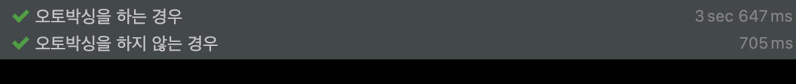

> REFERENCE:
>

[이펙티브 자바 Effective Java 3/E - YES24](http://www.yes24.com/Product/Goods/65551284)

[study/effective-java at master · keesun/study](https://github.com/keesun/study/tree/master/effective-java)

[https://github.com/woowacourse-study/2022-effective-java](https://github.com/woowacourse-study/2022-effective-java)

[[이팩티브 자바] #6 불필요한 객체를 만들지 말자](https://www.youtube.com/watch?v=0yUxPUXS1pM&list=PLfI752FpVCS8e5ACdi5dpwLdlVkn0QgJJ&index=6)

---

## 1️⃣. 객체를 매번 생성하기 보다는 재사용 하는 편이 좋다.

똑같은 기능의 객체를 매번 생성하기 보다는 객체 하나를 재사용하는 편이 좋을 때가 많다. (특히, 불편 객체(아이템17)은 언제든 재사용이 가능하다.)

만약, 무거운 객체라면 매번 생성할 때마다 많은 자원이 들어갈 것이고, 인스턴스를 자주 생성하게 되면 GC가 동작하게 될 확률이 높아진다. 이는 애플리케이션 성능 저하의 요인 중 하나이다.

해당 서적에서는 String을 통해 설명을 하고 있는데, 자세한 내용은 링크를 통해 알아가도록 하자.

[String, 〃Builder,〃Buffer 그리고 StringConstant pool](https://www.notion.so/String-Builder-Buffer-StringConstant-pool-1e573c779980419d99a13c85d34d9c0e)

[String을 왜 불변 객체로 만들었을까?](https://www.notion.so/String-576e315cfbd74986af5c8a832166eaf3)

즉 정리하자면, 같은 가상 머신 안에서 이와 똑같은 문자열 리터럴을 사용하는 모든 코드가 같은 객체를 재사용함이 보장된다고 할 수 있다. 이로 인해, 무의미한 객체를 생성할 필요가 없다.

## 2️⃣. 정적 팩토리 메소드를 이용하여 불필요한 객체 생성을 방지하자.

생성자 대신 정적 팩토리 메소드를 제공하는 불변 클래스는 정적 팩토리 메소드를 사용해 불필요한 객체 생성을 피할 수 있다.

생성자는 호출할 때마다 새로운 객체를 만들지만, 팩토리 메소드는 전혀 그렇지 않다.

불변 객체만이 아니라 가변 객체라 해도 사용중에 변경되지 않을 것임을 안다면 재사용 할 수 있다.

아래는 `Boolean 객체`를 통해 어떻게 불필요한 객체 생성을 방지하는지 알아보자.

```java
public final class Boolean implements java.io.Serializable, Comparable<Boolean> {

    public static final Boolean TRUE = new Boolean(true);
    public static final Boolean FALSE = new Boolean(false);
    
    // ...
    public static boolean parseBoolean(String s) {
        return "true".equalsIgnoreCase(s);
    }

    // ...
    public static Boolean valueOf(String s) {
        return parseBoolean(s) ? TRUE : FALSE;
    }
}
```

코드를 보면 `Boolean.valueOf(String)` 정적 팩토리 메소드를 사용해여 **미리 생성된 True, False를 반환하는 걸 확인할** 수 있다.

## 3️⃣. 객체 생성이 비싼 경우 캐싱을 통해 객체 생성을 방지해보자.

생성 비용이 아주 비싼 객체도 있다. 이런 비싼 객체가 반복해서 필요할 경우 캐싱해서 재사용하는 것을 권한다.

**비싼 객체란 말은 인스턴스를 생성하는데 드는 비용이 크다는 의미**이다. 즉 메모리 디스크 사용량, 대역폭 등이 높을수록 생성 비용이 비싸다고 한다.

대표적으로 `Pattern`을 예시로 들 수 있다.

```java
static boolean isRomanNumeral(String s) {
    return s.matches("^(?=.)M*(C[MD]|D?C{0,3})(X[CL]|L?X{0,3})(I[XV]|V?I{0,3})$");
}
```

`String.matches`가 가장 쉽게 정규 표현식에 매치가 되는지 확인하는 방법이긴 하지만 성능이 중요한 상황에서 반복적으로 사용하기에는 적절하지 않다.

그 이유는 내부적으로 `Pattern` 인스턴스를 만드러 사용하는데 `Pattern` 인스턴스는 입력받은 정규표현식의 유한 상태 머신을 만들기 때문에 생성 비용이 높다. 이런 생성 비용이 높은 `Pattern` 인스턴슬르 한 번 쓰고 버리는 구조로 만들어 곧바로 GC 대상이 되게 만들고 있다.

이런 문제를 개선하기 위해서는 `Pattern` 객체를 만들어 컴파일하고 재사용을 하는 것이 좋다.

```java
public class RomanNumber {
    private static final Pattern ROMAN = 
					Pattern.compile("^(?=.)M*(C[MD]|D?C{0,3})(X[CL]|L?X{0,3})(I[XV]|V?I{0,3})$");

    static boolean isRomanNumeral(String str) {
        return ROMAN.matcher(str).matches();
	}
}
```

두 방법의 성능을 확인해본 결과 캐싱된 인스턴스를 사용하는 경우 **약 10배 정도의 성능 향상**이 발생했다는 것을 확인할 수 있습니다.

> **정규 표현식의 유한 상태 머신**이란?
>
>
> 유한 상태 머신은 주어지는 모든 시간에서 처해 있을 수 있는 유한 개의 상태를 가지고 주어지는 입력에 따라 어떤 상태에서 다른 상태로 전환시키거나 출력이나 액션이 일어나게 하는 장치를 나타낸 모델이다.
>
> ```java
> 1. 아직 입력한 아무 문자도 보지 못한 상태에서 시작
> 
> 2. `j`라는 문자를 보면 `j`를 본 상태로 전이
> 
> 3. `a`라는 문자를 보면 `ja`까지 본 상태로 전이되지만 `a`가 아닌 다른 문자를 보게 되면 아직 아무 문자도 보지 못한 상태로 전이
> 
> 4. 입력 문자열을 모두 끝까지 탐색할때 까지 반복수행
> ```
>
> 즉, 간단한 정규표현식이라도 유한 상태 머신으로 변환될 경우 매우 큰 사이즈가 되게 된다.
>
> 일반적인 탐색과 다르게 모든 상태와 전이를 찾아놓은 상태에서 매칭을 진행하기 때문에 생성비용이 높다는 단점이 있다. 하지만 생성 이후 부터는 매칭이 빠르게 할 수 있어 컴파일러 시점에서 생성하는 것을 권장하고 있다.
>

## 4️⃣. 오토 박싱을 사용할 때 주의하라

오토 박싱은 기본 타입과 박싱 된 기본 타입을 자동으로 변환해주는 기술이다. 하지만 이를 잘못 사용하게 되면 불필요한 메모리 할당과 재할당을 반복하여 성능이 느려질 수 있다.

다음 코드를 통해서 한변 살펴보자.

```java
void autoBoxing_Test() {
    Long sum = 0L;
    for(long i = 0; i <= Integer.MAX_VALUE; i++) {
        sum += i;
    }
}

void noneBoxing_Test() {
    long sum = 0L;
    for(long i = 0; i < Integer.MAX_VALUE; i++) {
        sum += i;
    }
}

```


해당 코드를 통해 시간을 확인해볼 수 있다.

Long 타입에서 long 타입으로 변경해주는 것 만으로도 엄청난 성능 차이가 나는 것을 확인할 수 있다. 정리하자면, **꼭 박싱 타입이 필요한 경우가 아니라면 기본 타입을 사용하고, 의도치 않은 오토 박싱이 숨어들지 않게 주의**하자.