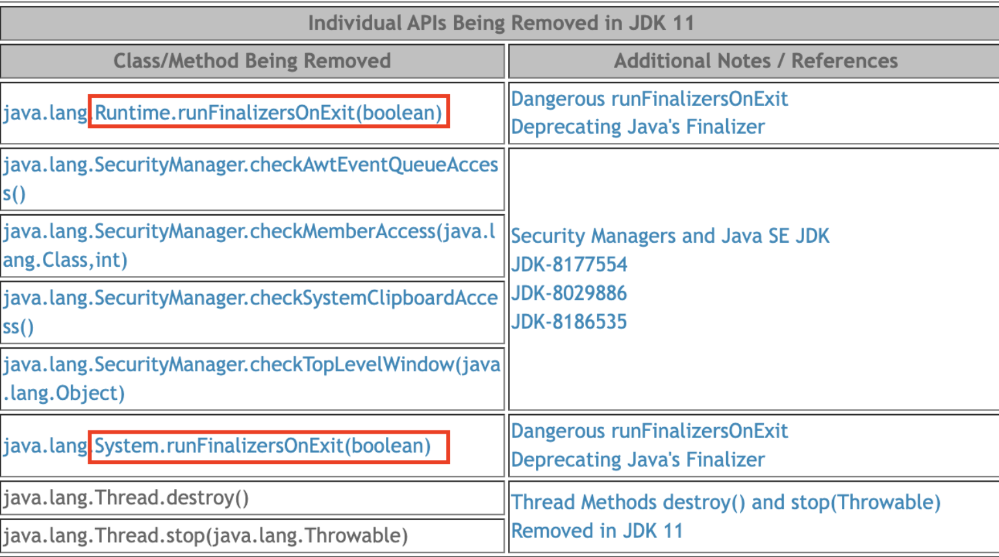

> REFERENCE:
>

[이펙티브 자바 Effective Java 3/E - YES24](http://www.yes24.com/Product/Goods/65551284)

[study/effective-java at master · keesun/study](https://github.com/keesun/study/tree/master/effective-java)

[https://github.com/woowacourse-study/2022-effective-java](https://github.com/woowacourse-study/2022-effective-java)

[[이팩티브 자바] #8 Finalizer와 Cleaner 쓰지 마세요](https://www.youtube.com/watch?v=sdPdpMYqW_k&list=PLfI752FpVCS8e5ACdi5dpwLdlVkn0QgJJ&index=8)

---

결론부터 말하자면 **finalizer와 cleaner를 ‘객체 사용이 끝나는 바로 그 시점에 소멸시켜야지!’ 용도로는 사용하지 말아야 한다.**

GC의 대상은 되지만 바로 수거해가는 것이 아니기 때문이다.

아래 코드들을 통해  finalizer가 deprecation된 걸 확인할 수 있다.

```java
/**
* Closes the stream when garbage is collected.
*/
/* deprecation이 된 걸 확인할 수 있다.*/
@SuppressWarnings("deprecation")
protected void finalize() throws IOException {
    close();
}
```

## 1️⃣. finalizer와 cleaner를 유용하게 사용할 일은 극히 드물다.

- 안전망 역할로 자원을 반납하려 할 때 사용을 권한다.
- 네이티브 자원을 정리할 때 사용을 권한다.

## 2️⃣. 즉시 수행된다는 보장이 없다.

finalizer와 cleaner는 **즉시 수행된다는 보장이 없습**니다. 언제 실행될 지 알 수 없으며 시간이 얼마나 걸릴지는 아무도 모른다. 즉 **원하는 시점에 실행하게 하는 작업은 절대 할 수 없다는 것이다.**

예를 들어,

1. 파일 리소스를 반납하는 작업을 처리한다면 그 파일 리소스가 언제 처리 될 지 알 수 없다.
2. 반납이 되지 않아 새로운 파일을 열지 못 하는 상황이 발생할 수 있다.
3. 동시에 열 수 있는 파일 개수가 제한되어 있기 때문이다.

## 3️⃣. 얼마나 빠르게 실행될 지 GC 알고리즘에 달렸고, 알 수도 없다.

얼마나 신속히 수행될 지는 가비지 컬렉터에게 기도를 해야 한다.

전적으로 GC 알고리즘에 달려있으며, 가비지 컬렉터마다 다르기 때문이다.

**프로그래머가 테스트한 JVM에선 완벽하게 동작하여도 고객의 시스템에선 재앙이 일어날 수 있기 때문이다.**

## 4️⃣. 우선순위가 낮다.

불행히도 Finalizer 쓰레드는 **우선순위가 낮아서** 실행될 기회를 얻지 못 할 수도 있다. 따라서, Finalizer 안에 어떤 작업이 있고, 그 작업을 쓰레드가 처리 못해서 대기하고 있다면, 해당 인스턴스는 GC가 되지 않고 계속 쌓이다가 결국엔 **`OutOfMomoryException`**이 발생할 수도 있다.

Clenaer는 별도의 쓰레드로 동작하니까 이 부분에 있어서 조금은 나을 수도 있지만 (해당 쓰레드의 우선순위를 높게 준더거나..), 여전히 해당 쓰레드는 백그라운드에서 동작하고 언제 처리될지는 알 수 없다.

## 5️⃣. 아예 실행되지 않을 수 있다.

수행 여부 조차 보장하지 않기 때문에 상태를 영구적으로 수정하는 작업에는 절대 finalizer와 cleaner에 의존해서는 안된다.

데이터베이스 같은 공유 자원의 영구 락 해제를 **`finalizer`**와 **`Cleaner`**에게 맡겨 놓으면 분산 시스템 전체가 서서히 멈출 것이다.

```java
@Override
protected void finalize() throws Throwable {
// 락걸린거 이 객체가 소멸될 때 같이 락을 해제하면 되겠다! -> X
}
```

## 6️⃣. 현혹되지 말자.

`System.gc` 나 `System.runFinalization` 메서드에 현혹되지 말자. `finalizer`와 `cleaner`가 실행될 가능성을 높여줄 순 있으나 보장하지 않는다.

이를 보장해주겠다는 메서드가 2개 등장했지만 심각한 결함때문에 몇년간 `deprecated` 상태다. → java11에선 삭제되었다.

## 7️⃣. finalizer는 동작 중 발생하는 예외를 무시한다.

`finalizer` 동작 중 발생한 **예외는 무시**되며, 처리할 작업이 남아있더라도 **그 순간 종료**된다. 잡지 못한 예외 때문에 해당 객체는 자칫 마루리가 덜 된 상태로 남을 수 있다. 보통의 경우 잡지 못한 예외가 스레드를 중단시키고 스택 추적 내역을 출력한다. 하지만 같은 일이 finalizer에서 발생한다면 경고조차 출력하지 않는다.

그나마 cleaner를 사용하는 라이브러리는 자신의 쓰레드를 통제하기 때문에 이러한 문제가 발생하지 않는다.

## 8️⃣. 성능적으로 문제가 있다.

`AutoCloseable` 객체를 생성하고 `try-with-resources`로 자원을 닫아서 가비지컬렉터가 수거하기까지 12ns가 걸렸다면 `finalizer`를 사용한 객체를 생성하고 파괴하니 550ns가 걸렸다. (50배)

`finalizer`가 가비지 컬렉터의 효율을 떨어지게 한다. 하지만 잠시 후 알아볼 안전망 형태로만 사용하면 66ns가 걸린다. 안전망의 대가로 50배에서 5배로 성능차이를 낼 수 있다.

## 9️⃣. 공격에 노출될 수 있다.

[자바에서 이런게 된다고? 네.. 가능합니다. 한번 보시죠!](https://www.youtube.com/watch?v=6kNzL1bl1kI)

생성이나 직렬화 과정에서 에외가 발생하면 생성되다 만 객체에서 악의적인 하위 클래스의 finalizer가 수행될 수 있게 된다.

```java
public class Account {

    private String name;

    public Account(String name) {
        this.name = name;
        if (this.name.equals("푸틴")){
            throw new IllegalArgumentException("푸틴은 안돼~");
        }
    }

    public void transfer(int amount, String to){
        System.out.printf("transfer %d from %s to %s.", amount, this.name, to);
    }
}
```

- 먼저 Account라는 class를 만들어 보자. 만약 푸틴이라는 이름의 객체를 만들면, Exception이 날라간 다는 걸 확인할 수 있다.

```java
		@Test
    void 일반_사람(){
        Account account = new Account("jjong0416");
        account.transfer(100, "sura");
    }

    @Test
    void 러시아(){
        Account account = new Account("푸틴");
        account.transfer(100, "sura");
    }
```

- 테스트 코드를 보게 되면, Exception이 터지는걸 확인할 수 있다.
- 하지만 이걸 뚫을 수 있다면?

```java
public class BrokenAccount extends Account{

    public BrokenAccount(String name) {
        super(name);
    }

    @Override
    protected void finalize() throws Throwable{
        this.transfer(10000, "sura");
    }
}
```

```java
		@Test
    void 한번_공격해보자() throws InterruptedException {
        Account account = null;

        try {
            account = new BrokenAccount("푸틴");
        } catch (Exception e){
            System.out.println("푸틴은 안되는데!?!?");
        }
        System.gc();
        Thread.sleep(3000L);
    }
```

- 공격이 된 것을 확인할 수 있다.


### 9️⃣-1️⃣. 어떻게 가능한 것일까?

**`finalize`**메소드는 객체가 GC(Garbage Collector)에 의해 수집될 때 자동으로 호출되며, 이 메소드에서 **`transfer`**메소드를 호출합니다.

코드에서 System.gc()를 호출하여 BrokenAccount 객체의 finalize 메소드를 실행하게 되고, transfer라는 메소드를 호출하게 되는 것입니다.

## 그러면 어떻게 사용해야할까?

`AutoCloseable`을 구현하고 클라이언트에서 인스턴스를 다 쓰고나면 close 메서드를 호출하면 된다. `try-finally`나 `try-with-resourse`를 사용하여 자원을 종료실킬 수 있다.

## 그럼 언제 쓰나요?

### A) **자원의 소유자가 close 메서드를 호출하지 않는 것에 대비**

cleaner, finalizer가 즉시 호출될것이란 보장은 없지만, 클라이언트가 하지 않은 자원 회수를 늦게라도 해주는 것이 아예 안하는 것보다 낫다. 하지만 이런 안전망 역할로 finalizer를 작성할 때 그만한 값어치가 있는지 신중히 고려해야 한다. 자바에서는 안전망 역할의 `finalizer`를 제공한다. `FileInputStream`, `FileOutputStream`, `ThreadPoolExecutor`가 대표적이다.

### B) 네이티브 자원 정리

`cleaner`와 `finalizer`를 적절히 활용하는 두 번째 예는 네이티브 피어와 연결된 객체이다. 네이티브 피어란 일반 자바 객체가 네이티브 메서드를 통해 기능을 위임한 네이티브 객체를 말한다. 그 결과 자바 피어를 회수할 때 네이티브 객체까지 회수하지 못 한다. 성능 저하를 감당할 수 없거나 자원을 즉시 회수해야 한다면 close 메서드를 사용해야 한다.

## Cleaner 예제 코드

```java
public class Room implements AutoCloseable {

    private static final Cleaner cleaner = Cleaner.create();

    // Room을 참조하지 말 것!! 순환 참조
    private static class State implements Runnable {

        int numJunkPiles;

        State(int numJunkPiles) {
            this.numJunkPiles = numJunkPiles;
        }

        // close가 호출되거나, GC가 수거해갈 때 run() 호출
        @Override
        public void run() {
            System.out.println("Room Clean");
            numJunkPiles = 0;
        }
    }

    private final State state;
    private final Cleaner.Cleanable cleanable;

    public Room(int numJunkPiles) {
        state = new State(numJunkPiles);
        cleanable = cleaner.register(this, state);
    }

    @Override
    public void close() throws Exception {
        cleanable.clean();
    }
}
```

State 인스턴스가 Room 인스턴스를 참조할 경우 순환참조가 발생하고, 가비지 컬렉터가 `Room`을 회수해 갈 때 기회가 오질 않는다. State가 static인 이유도 바깥 객체를 참조하지 않기 위해서다.

위 코드는 안전망을 만들었을 뿐이다. 클라이언트가 try-with-resoureces 블록으로 감쌌다면 방 청소를 정상적으로 출력한다.

```java
public class Main {
    public static void main(String[] args) throws Exception {
        try(Room myRoom = new Room(8)) {
            System.out.println("방 쓰래기 생성~~");
        }
    }
}

/* 출력
	방 쓰래기 생성~~
	Room Clean
*/
```

하지만,  아래와 같은 코드는 방 청소 완료라는 메시지를 항상 기대할 순 없다.

```java
public static void main(final String[] args) {
    new Room(8);
    System.out.println("방 쓰레기 생성~~");
}
/**
	방 쓰레기 생성~~
*/
```