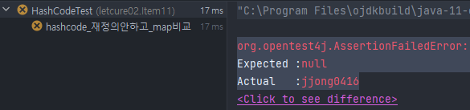
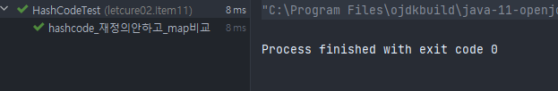
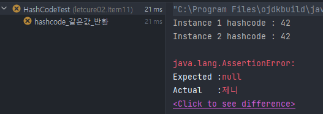

> REFERENCE:
>

[이펙티브 자바 Effective Java 3/E - YES24](http://www.yes24.com/Product/Goods/65551284)

[https://github.com/woowacourse-study/2022-effective-java](https://github.com/woowacourse-study/2022-effective-java)

[Item 11. Equals를 재정의하려거든 Hashcode도 재정의하라 | Carrey`s 기술블로그](https://jaehun2841.github.io/2019/01/12/effective-java-item11/#좋은-해시-함수-만들기)

## 0️⃣. 서론

`equals를 재정의한 클래스에서는 hashcode도 재정의 해야한다.` 그렇지 않으면 hash를 사용하는 HashMap, HashSet과 같은 컬렉션의 원소로 사용될 때 문제가 발생할 것이다.

아래는 Object 명세에서 발췌한 규약이다.

## 1️⃣. hashcode 규약

- equals비교에 사용되는 정보가 변경되지 않았다면, 객체의 hashcode 메서드는 몇번을 호출해도 항상 일관된 값을 반환해야 한다.(단, Application을 다시 실행한다면 값이 달라져도 상관없다.
- **equals(Object)메서드 통해 두 개의 객체가 같다고 판단했다면, 두 객체는 똑같은 hashcode 값을 반환해야 한다.**
- **equals메서드가 두 개의 객체를 다르다고 판단했다 하더라도, 두 객체의 hashcode가 서로 다른 값을 가질 필요는 없다.** (Hash Collision)단, 다른 객체에 대해서는 다른 값을 반환해야 해시테이블의 성능이 좋아진다.

## 2️⃣. ****equals 메서드는 재정의했지만, hashcode를 재정의하지 않은 경우****

hashCode 재정의를 잘못했을 때 크게 문제가 되는 조항은 바로 두 번째다. 즉, 논리적으로 같은 객체는 같은 해시코드를 반환해야 한다.

**Effective Java 11장에서 설명하는 PhoneNumber 클래스를 생성해 테스트를 해볼것인데, 지금까지 공부한 부분들을 적용해서 작성해볼 것이다.**

```java
public class PhoneNumber {

    protected int firstNumber;
    protected int secondNumber;
    protected int lastNumber;

    @Builder(access = AccessLevel.PRIVATE)
    protected PhoneNumber(
            final int firstNumber,
            final int secondNumber,
            final int lastNumber
    ){
        this.firstNumber = firstNumber;
        this.secondNumber = secondNumber;
        this.lastNumber = lastNumber;
    }

    public static PhoneNumber of(
            final int firstNumber,
            final int secondNumber,
            final int lastNumber
    ) {
        return PhoneNumber.builder()
                .firstNumber(firstNumber)
                .secondNumber(secondNumber)
                .lastNumber(lastNumber)
                .build();
    }
}
```

- 핸드폰 클래스를 만듭니다.

~~protected로 한 이유는 나중에 상속을 추가적으로 진행할 것이기 때문에 무시하셔도 됩니다.~~

객체를 생성해서 map에 저장하고 map에서 저장된 객첼르 조회하는 테스트 코드를 작성해봅시다.

```java
@Test
@DisplayName("해시코드를 재정의하지 않아 값을 찾지 못한다.")
public void hashcode_재정의안하고_map비교(){
    Map<PhoneNumber, String> map = new HashMap<>();
    map.put(PhoneNumber.of(707,867,5309), "jjong0416");
    assertEquals(map.get(
            PhoneNumber.of(707,867,5309)), "jjong0416");
}
```



왜 실패하게 되었을까요?

논리적 동치인 **두 객체가 서로 다른 해시코드를 반환하여 null을 반환**하게 됩니다. 그 결과 get 메소드는 엉뚱한 곳에서 객체를 찾으려 한 것입니다. 이러한 문제는 PhoneNumber에 적절한 hashCode를 작성해주면 해결이 됩니다.

```java
public class PhoneNumber {
		...
    @Override
    public boolean equals(Object o) {
        // 1. == 연산자를 사용해 입력이 자기 자신의 참조인지 확인한다.
        if (this == o) {
            return true;
        }

        // 2. instanceof 연산자로 입력이 올바른 타입인지 확인한다.
        if (!(o instanceof PhoneNumber)) {
            return false;
        }

        // 3. 입력을 올바른 타입으로 형변환 후, 비교를 한다.
        PhoneNumber p = (PhoneNumber) o;
        return this.firstNumber == p.firstNumber &&
                this.secondNumber == p.secondNumber &&
                this.lastNumber == p.lastNumber;
    }

    @Override
    public int hashCode() {
        return Objects.hash(firstNumber,secondNumber,lastNumber);
    }
}
```

그리고 다시 한 번 테스트를 실행하도록 하겠습니다.



정상적으로 성공한 걸 확인할 수 있다.

그렇다면, 올바른 hashCode 메소들는 어떤 모습이여야 할까요?

## 4️⃣. hashCode 작성하는 법

### A) 최악의 hashcode 함수 구현

```java
@Override
public int hashCode() {
  return 42;
}
```

이 코드는 동치인 모든 객체에서 똑같은 해시코드를 반환하니 적법한 해시코드 처럼 보인다.

하지만, 모든 객체에 대해 똑같은 해시코드를 반환하니 모든 객체가 같은 해시테이블 버킷에 담겨 연결리스트(Linked List)처럼 동작하게 된다.

평균 수행시간이 O(1)에서 O(n)으로 느려져서, 성능이 매우 낮아질 뿐더러 버킷에 대한 overflow가 발생하는 경우 데이터가 누락될 수도 있다.

```java
@Test
public void hashcode_같은값_반환() {
    HashMap<ExtendedPhoneNumber, String> map = new HashMap<>();
    map.put(new ExtendedPhoneNumber(707, 867, 5307), "제니");
    System.out.println("Instance 1 hashcode : " + 
            new ExtendedPhoneNumber(707, 867, 5307).hashCode());
    System.out.println("Instance 2 hashcode : " + 
           new ExtendedPhoneNumber(707, 867, 5301).hashCode());
   //다른 객체를 넣어 데이터를 조회해 보았다.
    Assert.assertEquals(map.get(new ExtendedPhoneNumber(707, 867, 5301)), "제니");
}
```

그러면 같은 42를 반환하니깐 당연히 통과가 되겠지?



이 결과로 보아하니, hashcode가 같으면 같은 버킷에 LinkedList로 저장되면서 객체에 대해 equals 체크를 통해 데이터를 조회하는 것으로 판단 된다.

설사 두 인스턴스가 같은 버킷에 담았더라도, hashmap.get메서드는 null을 반환한다. 만약 hashcode가 다른경우에는 동치성비교를 실행하지 않도록 최적화 되어있기 때문이다. hashcode가 같더라도 동치성비교(equals)를 실행하여 객체에 대한 값(value)를 조회한다.

### B) 좋은 hashcode 함수 구현

**좋은 해시 함수는 서로 다른 인스턴스에 다른 해시코드를 반환**한다. 아래 바로 hashcode의 세번째 규약이 요구하는 속성입니다.

이상적인 해시 함수는 주어진 (서로 다른) 인스턴스들을 32비트 정수 범위에 균일하게 분배해야 한다

```java
@Override
public int hashCode() {
		int c = 31;
    
		//1. int변수 result를 선언한 후 첫번째 핵심 필드에 대한 hashcode로 초기화 한다.
    int result = Integer.hashCode(firstNumber);

    //2. 기본타입 필드라면 Type.hashCode()를 실행한다
    //Type은 기본타입의 Boxing 클래스이다.
    result = c * result + Integer.hashCode(secondNumber);

    //3. 참조타입이라면 참조타입에 대한 hashcode 함수를 호출 한다.
    //4. 값이 null이면 0을 더해 준다.
    result = c * result + address == null ? 0 : address.hashCode();

    //5. 필드가 배열이라면 핵심 원소를 각각 필드처럼 다룬다.
    for (String elem : arr) {
      result = c * result + elem == null ? 0 : elem.hashCode();
    }

    //6. 배열의 모든 원소가 핵심필드이면 Arrays.hashCode를 이용한다.
    result = c * result + Arrays.hashCode(arr);

    //7. result = 31 * result + c 형태로 초기화 하여 
    //result를 리턴한다.
    return result;
}
```

- 곱할 숫자가 31로 지정하는 이유는 31이 홀수이면서 소수(prime)이기 때문이다. 2를 곱하는 것은 shift 연산과 같은 결과를 내기 때문에 추천하지 않는다.
  - 이거에 대한 말은 많다. 단지 면접에서 질문 들어오면 홀수와 소수 + 관례라고 하는게 베스트
- 또한, 31을 이용하면 `(i<<5) - i`와 같이 최적화를 할 수 있다.
- **참고로 Lombok 라이브러리의 @EqualsAndHashCode는 59를 곱한다..**

그리고 hashcode를 다 구현했다면, 이 메소드가 동치인 인스턴스에 대해 똑같은 해시코드를 반환하는지 TestCase를 꼭 작성하자.

## 5️⃣. hashcode를 편하게 만들어주는 모듈

- Objects.hash()
  - 내부적으로 AutoBoxing이 일어나 성능이 떨어진다.
- Lombok의 **@EqualsAndHashCode**
- Google의 @AutoValue

## 6️⃣. hashcode를 재정의 할 때 주의할 점

- 불변 객체에 대해서는 hashcode 생성비용이 많이 든다면, hashcode를 캐싱하는 것도 고려하자
  - 스레드 안전성까지 고려해야 한다.
- 성능을 높인답시고 hashcode를 계산할 떄 핵심필드를 생략해서는 안된다.
  - 속도는 빨라지겠지만, hash품질이 나빠져 해시테이블 성능을 떨어뜨릴 수 있다 (**Hashing Collision**)
- hashcode 생성규칙을 API사용자에게 공표하지 말자
  - 그래야 클라이언트가 hashcode값에 의지한 코드를 짜지 않는다.
  - 다음 릴리즈 시, 성능을 개선할 여지가 있다.