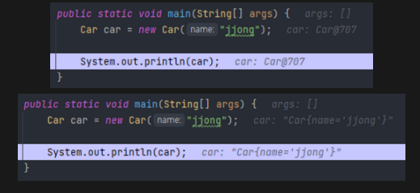

> REFERENCE:
>

[이펙티브 자바 Effective Java 3/E - YES24](http://www.yes24.com/Product/Goods/65551284)

[https://github.com/woowacourse-study/2022-effective-java](https://github.com/woowacourse-study/2022-effective-java)

[Item 12. toString을 항상 재정의하라 | Carrey`s 기술블로그](https://jaehun2841.github.io/2019/01/13/effective-java-item12/#toString을-재정의-해야하는-이유)

[toString을 항상 재정의하라](https://100100e.tistory.com/421)

---

## 0️⃣. 서론

Object의 기본 toString 메소드가 우리가 작성한 클래스에 적절한 문자열을 반환하는 경우는 거의 없다. 이 메소드는 PhoneNumber@adbbd 처럼 단순히 **클래스이름@16진수로_표현한_해시코드**를 반환할 뿐이다. toString의 일반 규약을 따르면, **간결하면서 사람이 읽기 쉬운 형태의 유익한 정보**를 반환할 뿐이다. toSting의 규약은 모든 `하위 클래스에서 이 메소드를 재정의하라` 라고 하고 있다.

## 1️⃣. toString을 재정의 하지 않은 예시와 한 예시



## 2️⃣. toString을 어떻게 재정의하는 것이 좋을까?

### A) 간결하면서 사람이 읽기 쉬운 형태의 유익한 정보를 담아야 한다.

```java
PhoneNumber@adbbd -> 012-1234-5678   
Car@707           -> Car{name=sun, position=2}
```

### B) 객체가 가진 주요 정보 모두를 반환하는게 좋다.

```java
public class Address {
    private final String city;
    private final String gu;
    private final String dong;

    Address(String city, String gu, String dong) {
        this.city = city;
        this.gu = gu;
        this.dong = dong;
    }

    @Override
    public String toString() {
        return "Address{" +
                "city='" + city + '\'' +
                ", gu='" + gu + '\'' +
                '}';
    }
}
```

이런 식으로 일부를 반환하는 것은 좋은 방법이 아니다. 만약 객체가 거대하거나 객체의 상태가 문자열로 표현하기 적합하지 않다면 요약 정보를 담아야 한다.

### C) toString을 구현할 때면 반환값의 포맷을 문서화할지 정해야 한다.

전화번호부나 행렬 같은 값 클래스라면 문서화를 권장한다. 포맷을 명시하면 객체는 표면적이고 명확하고, 사람이 읽을 수 있게 된다. 또한, 포맷에 맞는 문자열과 객체를 상호전환 할 수 있는 정적 팩토리나 생성자를 함께 제공하면 좋다.

```java
@Override
public String toString() {
    return String.format("%s-%s-%s", firstNumber, secondNumber, lastNumber);
}
```

```java
// 포맷 적용 전,
PhoneNumber{firstNumber='010', secondNumber='8743', lastNumber='xxxx'}

// 포맷 적용 후,
010-8743-7275
```

다만 포맷 명시에도 단점이 있는데,

- 평생 그 포멧에 얽매이게 된다.
- 포맷을 명시하게 된다면 다음 릴리즈에 포맷을 변경할 수 있는 유연성을 가져가기 어렵다.

따라서 포맷 명시 여부와 상관없이 toString이 반환한 값에 포함된 정보를 얻어올 수 있는 `API를 제공해야 한다.` 접근자를 제공하지 않으면 이 정보가 필요한 프로그래머는 toString의 반환값을 파싱해야 하는데, 이는 성능을 떨어뜨림과 동시에 불필요한 작업이고, 향후 포맷을 바꾸면 시스템이 망가지는 결과를 초래할 수 있다.

## 3️⃣. toString을 따로 재정의를 안해줘도 되는 경우

- 정적 유틸리티(Utils) 클래스는 따로 재정의하지 않아도 된다.

  (객체의 상태(state)를 가지는 클래스가 아니기 때문에)

- 이미 완벽한 toString을 제공해주는 Enum 타입은 해줄 필요가 없다.
- 대다수의 컬렉션 구현체는 추상 컬렉션 클래스의 toString을 상속하여 쓴다.
- 라이브러리를 통해 자동생성해서 쓰자.
    - 구글의 @Autovalue
    - Lombok의 @ToString