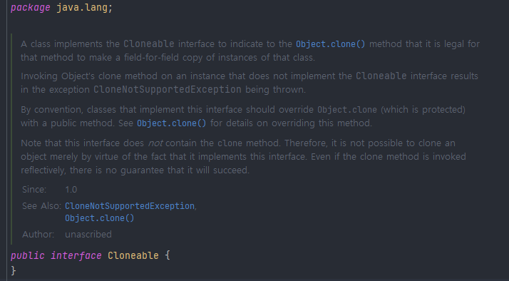
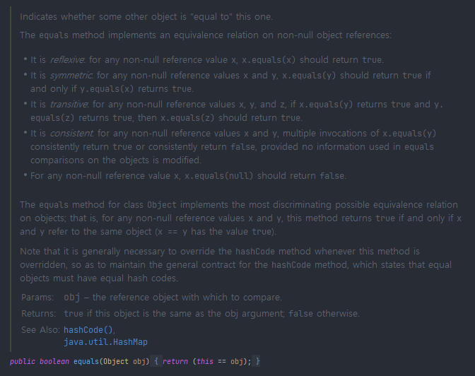

> REFERENCE:
>

[이펙티브 자바 Effective Java 3/E - YES24](http://www.yes24.com/Product/Goods/65551284)

[https://github.com/woowacourse-study/2022-effective-java](https://github.com/woowacourse-study/2022-effective-java)

[Item 13. Clone 재정의는 주의해서 진행하라 | Carrey`s 기술블로그](https://jaehun2841.github.io/2019/01/13/effective-java-item13/#가변-상태를-갖는-필드에-대한-복제)

---

## 1️⃣. Cloneable 인터페이스는 무슨 일을 할까?



자바의 Cloneable 인터페이스를 보면 아무런 메소드가 없다. 아무것도 없지만, 사실은 **Object의 protected 메소드인 clone 메소드의 동작방식을 결정**한다. Cloneable을 구현한 클래스의 인스턴스에서 clone을 호출하면 그 객체의 필드들을 하나하나 복사한 객체를 반환하며, 그렇지 않은 클래스의 인스턴스에서 호출하면 CloneNotSupportedException을 던집니다.

## 2️⃣. Object 클래스의 clone 규약



Object에 명시된 clone 규약이 주석으로 쓰여져 있다. 하나씩 알아보자.

- x.clone() != x은 참이다.복사한 객체와 원본 객체는 서로 다른 객체이다.
- x.clone() .getClass() == x.getClass()은 일반적으로 참이다. 하지만 반드시 만족해야 하는 것은 아니다.
- x.clone.equals(x) 은 참이다.복사한 객체와 원본객체는 논리적 동치성이 같다.
- Cloneable을 구현하지 않은 클래스의 경우, CloneNotSupportedException이 throw된다.
- 모든 Array는 Cloneable을 구현하도록 고려되었다. clone 메서드는 T[]를 리턴하도록 설계
- 기본적으로 Object.clone은 clone대상 클래스에 대해 새로운 객체를 new로 생성
- 모든 필드들에 대해 초기화를 진행
- **하지만 필드에 대한 객체를 다시 생성하지 않는 Shallow copy 방식으로 수행한다 (deep copy아님)**

## 3️⃣. clone() 메소드 재정의 시, 주의할 점

### A) 기본적인 clone 메소드 재정의

```java
class PhoneNumber implements Cloneable {
  @Override
  public PhoneNumber clone() {
    try {
      return (PhoneNumber) super.clone();
    } catch(ClassNotSupportedException e) {
      //아무처리를 하지 않거나, RuntimeException으로 감싸는 것이 사용하기 편하다.
    }
  }
}
```

- super.clone()을 실행하면 PhoneNumber에 대한 완벽한 복제가 이루어집니다.
- super.clone()의 리턴 타입은 Object이지만, 자바의 공변 반환타이핑 기능을 통해 PhoneNumber 타입으로 캐스팅하여 리턴하는 것이 가능하다.
- try-catch 부분으로 감싼것은 super.clone() 메소드에서 ClassNotSupportedException이라는 checked Exception을 리턴하기 때문에 처리해주는 것이 좋다.
    - 하지만 PhoneNumber가 Cloneable을 구현하기 떄문에 절대 실패하지 않는다.따라서 이부분은 RuntimeException으로 처리하거나, 아무것도 설정하지 않아야 한다.
    - 인텔리제이한테 맡기면 아래와 같이 throws를 해주기도 한다.

    ```java
    public class User implements Cloneable {
    		...
        @Override
        protected Object clone() throws CloneNotSupportedException {
            return super.clone();
        }
    }
    ```


- Object 클래스의 clone 메소드의 접근제한자는 protected이기 때문에 implements를 받아서 구현을 하게 됩니다. 또한, 반환타입이 Object인 걸 확인할 수 있습니다.

    ```java
    @Test
    @DisplayName("객체 복사")
    public void 객체_복사() throws CloneNotSupportedException {
        User user = new User("jayden-lee");
        User user2 = (User) user.clone();
        Assert.assertEquals(user.getName(), user2.getName());
    }
    ```


### B) 가변 상태를 갖는 필드에 대한 복제

```java
public class Stack implements Cloneable{
  private Object[] elements;
  private int size = 0;
  private static final int DEFAULT_INITIAL_CAPACITY = 16;

  public Stack() {
    this.elements = new Object[DEFAULT_INITIAL_CAPACITY];
  }

  public void push(Object o) {}
  }
  ...

  @Override
  public Stack clone() {
    try {
      Stack result = (Stack) super.clone();
      result.elements = 
    } catch(CloneNotSupportedException e) {
    }
  }
}
```

이 클래스가 단순히 clone메서드를 이용해 super.clone()만 실행하게 된다면, new Stack()을 통해 새로운 객체가 생성되고 필드모두 원본 객체와 동일하게 초기화가 될 것이다. 하지만, 위에서 얘기한 **Object의 clone 기본규약에는 Deep copy가 아닌 Shallow Copy를 이용해 초기화를 진행**한다고 적혀있다. 따라서 배열과 같은 가변필드는 원본 필드와 **객체를 공유**하게 된다.

### C) clone 메소드는 사실상 생성자와 같은 효과를 낸다

clone은 원복 객체에 아무런 해를 끼치지 않는 동시에 복제된 객체의 불변식을 보장해야 한다. 이를 해결하기 가장 쉬운 방법은 `elements`배열의 clone을 `재귀적으로`호출해주는 것이다.

```java
public class Stack {
    private Object[] elements;
    private int size = 0;
        ...
		
		@Override
    public Stack clone() {
        try {
            Stack result = (Stack) super.clone();
            result.elements = elements.clone();
            return result;
        } catch (CloneNotSupportedException e) {
            throw new AssertionError();
        }
    }
}
```

따라서 배열을 복제할 때는 배열의 clone 메소드를 사용하라고 권장하고 있습니다.

하지만, array 필드가 final이 적용되어 있다면 array.clone()을 통한 초기화는 할 수 없다. (final이기 떄문에 객체 생성 이후 초기화 불가)

Cloneable 아키텍처는 가변객체를 참조하는 필드는 final로 선언하라 라는 일반 용법과 충돌한다.

그래서 복제 할 수 있는 클래스를 만들기 위해 일부 필드에서 final 한정자를 제거해야 할 수도 있다.

## 4️⃣. ****Stack overflow 문제****

그런데 clone을 재귀적으로 호출하는 것만으로는 충분하지 않을 때도 있다. 이번에는 해시테이블용 clone 메서드를 생각해보자. 해시테이블 내부는 `버킷들의 배열`이고, 각 버킷은 `키-값 쌍을 담는 연결 리스트`의 첫 번째 엔트리를 참조한다.

```java
public class HashTable implements Cloneable  {
  private Entry[] buckets = ...;

  private static class Entry {
    final Object key;
    Object value;
    Entry next;

    Entry(Object key, Object value, Entry next) {
      this.key = key;
      this.value = value;
      this.next = next;
    }
  }

  @Override
  public HashTable clone() {
    try {
      HashTable result = (HashTable) super.clone();
      result.buckets = buckets.clone();
      return result;
    } catch(CloneNotSupportedException e) {
      throw new Assertion();
    }
  }
}
```

복제본은 자신만의 버킷 배열은 갖지만, 배열내의 Entry는 **원본과 같은 연결리스트를 참조**하여, 불변성이 깨지게 된다.

그래서 HashTable.Entry 클래스는 내부적으로 deep copy를 지원하도록 보강되었다.

```java
public class HashTable implements Cloneable {
        ...

        Entry deepCopy() {
            return new Entry(key, value, next == null ? null : next.deepCopy());
        }

        @Override
        public HashTable clone() {
            try {
                HashTable result = (HashTable) super.clone();
                result.buckets = new Entry[buckets.length];
                for (int i = 0; i < buckets.length; i++)
                    if (buckets[i] != null)
                        result.buckets[i] = buckets[i].deepCopy();
                    return result;
            } catch (CloneNotSupportedException e) {
                throw new AssertionError();
            }
    }
```

연결리스트에 대한 next를 복제할 때 재귀적으로 clone을 호출하도록 되어있는데, **재귀 호출 떄문에 연결리스트의 size만큼 스택프레임을 소비**하여, 리스트가 길면 `stackoverflow에러`를 발생시킬 위험이 있다. 이 문제를 해결하기 위해서는 재귀 호출을 통한 deepcopy대신 반복자를 써서 순회하는 방법으로 수정해야 한다.

## 4️⃣. 그러면 어떻게 복사하는게 베스트 프렉티스일까?

### A) 복사 생성자

```java
public Yum(Yum yum) {}
```

```java
public class CopyConstructor {
    private String name;
    private int age;
    private Set<String> subjects;

    public CopyConstructor(String name, int age, Set<String> subjects) {
        this.name = name;
        this.age = age;
        this.subjects = subjects;
    }

    // 복사 생성자
    public CopyConstructor(CopyConstructor copyConstructor) {
        this.name = copyConstructor.name;
        this.age = copyConstructor.age;

        // 얕은 복사
        // this.subjects = student.subjects;

        // 깊은 복사 – `HashSet`의 새 인스턴스 생성
        this.subjects = new HashSet<>(copyConstructor.subjects);
    }
}
```

### B) 복사 팩토리 메소드

```java
public static Yum newInstance(Yum yum) {}
```

```java
public class CopyFactory {
    private String name;
    private int age;
    private Set<String> subjects;

    public CopyFactory(String name, int age, Set<String> subjects) {
        this.name = name;
        this.age = age;
        this.subjects = subjects;
    }

    // 팩토리 복사
    public static CopyFactory newInstance(CopyFactory copyFactory) {
        return new CopyFactory(copyFactory);
    }
		...
}
```

### C) 장점

복사 생성자와 복사 팩토리 메소드는 Cloneable/clone 방식보다 나은 면이 많다.

1. 언어 모순적이고 위험한 객체 생성 매커니즘을 사용하지 않는다. (super.clone())
2. clone 규약에 기대지 않는다.
3. 정상적인 final 필드 문법과도 충돌하지 않는다.
4. 불필요한 check exception 처리가 필요없다.
5. 형변환도 필요 없다.
6. 복사 생성자와 복사 팩터리는 인터페이스 타입의 인스턴스를 인수로 받을 수 있다.

예시를 통해 한번 만들어보자.

## 5️⃣.핵심 정리

`Cloneable`이 몰고 온 모든 문제를 되짚어봤을 때, 새로운 인터페이스를 만들 때는 절대 Cloneable을 확장해서는 안 되며, 새로운 클래스도 이를 구현해서는 안 된다. final 클래스라면 Cloneable을 구현해도 위험이 크지 않지만, `성능 최적화 관점에서 검토한 후 별다른 문제가 없을 때만 드물게 허용해야 한다.`
기본 원칙은 '`복제 기능은 생성자와 팩터리를 이용하는 게 최고`'라는 것이다.

`단, 배열만은 clone 메서드 방식이 가장 깔끔한 이 규칙의 합당한 예외라 할 수 있다.`