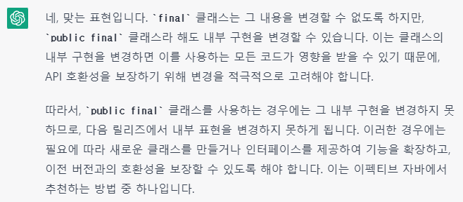

> REFERENCE:
>

[이펙티브 자바 Effective Java 3/E - YES24](http://www.yes24.com/Product/Goods/65551284)

[https://github.com/woowacourse-study/2022-effective-java](https://github.com/woowacourse-study/2022-effective-java)

[Item 17. 변경 가능성을 최소화하라 | Carrey`s 기술블로그](https://jaehun2841.github.io/2019/01/20/effective-java-item17/#불변-클래스-immutable-class-란)

[[Effective Java] 17.변경 가능성을 최소화하라](https://codingwell.tistory.com/99)

---

## 1️⃣. 불변 클래스(immutable class)란?

- 인스턴스의 내부 값을 수정할 수 없는 클래스를 말한다.
- 불변 클래스의 인스턴스는 객체가 생성되는 시점에 초기화되고, 소멸될 때 까지 값이 변경되지 않는다.
- 불변 클래스는 가변 클래스보다 설계/구현/사용이 쉽다.
- 값이 변경되지 않으니 오류가 발생할 일도 적고 안전하다.
    - 근본적으로 스레드 안전하기 때문에 따로 동기화할 필요가 없다.

## 2️⃣. 불변 클래스를 만들기 위한 5가지 조건

### A) 객체의 상태를 변경하는 메소드(변경자)를 제공하지 않는다.

- 쉽게 말해 setter나, 필드 정보를 변경하는 메소드를 제공하지 않는다.

### B) 클래스를 확장할 수 없도록 한다.

- 하위 클래스에서 부주의하게 객체의 상태를 변경하는 걸 막기 위해 클래스를 final로 선언하여 상속을 금지시킨다.
    - `하지만 클래스에 final을 안쓰더라도 불변 클래스를 만들 수 있습니다 😊`

    ```java
    public class ImmutableClass {
        private final int num;
        private final String str;
        private final List<Integer> list;
    
        public ImmutableClass(int num, String str, List<Integer> list) {
            this.num = num;
            this.str = str;
            this.list = new ArrayList<>(list);
        }
    
        public int getNum() {
            return num;
        }
    
        public String getStr() {
            return str;
        }
    
        public List<Integer> getList() {
            return new ArrayList<>(list);
        }
    }
    ```

    - 모든 인스턴스 변수는 final로 선언되어 있고, 생성자에서 인스턴스 변수를 초기화 후, 다시 변경하지 않습니다.
    - 인스턴스 변수로 참조하는 객체가 변경 가능한 객체일 경우, 복제(clone)하여 참조하면 됩니다.
- 모든 생성자는 private으로 만들고, 생성자 정적 팩토리 메소드를 제공한다.
    - 정적 팩토리 메소드는 유연성을 제공한다.
- 다음 릴리즈에서 Boolean처럼 **캐싱**을 이용한 성능을 끌어올릴 수 있다.

```java
@NoArgsConstructor(access = AccessLevel.PRIVATE)
@AllArgsConstructor(access = AccessLevel.PRIVATE, staticName="of")
public class Member {
  private String name;
  private int age;
}
```

### C) 모든 필드를 final로 선언한다.

```java
@AllArgsConstructor(access = AccessLevel.PRIVATE, staticName="of")
public class Member {
  private final String name;
  private final int age;
}
```

- 필드에 대해 수정을 막겠다는 설계자의 의도를 보여준다. final 클래스는 생성자에 딱 **1회 초기화** 할 수 있기 때문이다.
- 인스턴스에 대한 동기화(synchronized) 처리 없이도 다른 스레드에서 문제없이 처리된다.

### D) 모든 필드를 private로 선언한다.

- 필드가 참조하는 가변 객체를 클라이언트에서 직접 접근하여 수정하는 일을 막는다.
- **public final로만 처리해도 되지만, 그 안의 내용을 바꿀 수 있고 다음 릴리즈에서 내부 표현을 변경하지 못하므로 사용하지 않는게 좋다.**



### E) 자신(객체) 이외에는 내부의 가변 컴포넌트에 접근할 수 없도록 한다.

- 클라이언트에서 인스턴스 내에 가변 객체의 참조를 얻을 수 없게 해야한다. - Collection에 대한 getter를 제공하면 안된다!
- 생성자, 접근자(getter), readObject 메서드에서 모두 `방어적 복사`(아이템 50)를 수행해야 한다.

## 3️⃣. 불변  객체를 만드는 규칙

무조건 private를 붙인다고 불변 객체가 되는 것은 아니다. 먼저 알아야 할 사실 중 하나는 `불변 클래스를 만들면 그 클래스의 인스턴스는 불변 객체가 된다` 라는 것이다.

이것을 바탕으로 조금 더 디테일하게 알아보자면

1. 클래스를 확장할 수 없도록 class level에 final을 붙인다.
2. 객체의 상태를 변경할 수 있는 메소드를 제공하지 않는다.
3. 생성자를 private로 잠근다.
    1. 이 때 더 좋은 방식은 정적 팩토리 메소드를 제공해주는 것이다.
4. 모든 필드를 private final로 만든다. 물론 public final로 만들어도 충분하다.
    - 하지만, private final로 만들자.
    - 아이템 15. 클래스와 멤버의 접근 권한을 최소화하라.
    - 아이템 16. public 클래스에서는 public 필드가 아닌 접근자 메소드를 사용하라.

```java
public final class Money {
    private final int value;
    
    private Money(int value){
        this.value = value;
    }
    
    public static Money valueOf(int value){
        return new Money(value);
    }
    
    public int getValue(){
        return this.value;
    }
}
```

### A) 해당 코드는 왜 불변이 아닐까?

```java
public class Nation {
    private final City capital;
    private final List<City> cities;
    private final long population;

    public Nation(City capital, List<City> cities, long population) {
        this.capital = capital;
        this.cities = cities;
        this.population = population;
    }

    public City getCapital() {
        return capital;
    }

    public List<City> getCities() {
        return cities;
    }

    public long getPopulation() {
        return population;
    }
}
```

- 정답은 가변 컴포넌트에 바로 접근할 수 있기 때문이다.

### B) 그러면 어떻게 만들어야 하나요?

```java
public class Lotto {
    private final List<Integer> numbers;

    public Lotto(List<Integer> numbers) {
        this.numbers = List.copyOf(numbers);
    }

    public List<Integer> getNumbers() {
        return Collections.unmodifiableList(numbers);
    }
}
```

- 자신 외에는 내부의 가변 컴포넌트에 접근할 수 없도록 만들어야 합니다.
- 생성자에서 `List.copyOf()` 메소드를 통해 리스트를 복사하여 불변성을 보장합니다.
    - 생성자에서 받은 numbers 리스트를 그대로 사용하게 되면, 외부에서 numbers 리스트를 변경할 수 있습니다. 이를 방지하기 위해 사용한다.

## 4️⃣. 불변 객체의 장점

- 불변 객체는 생성 시점부터 소멸될 때 까지 변하지 않는다. - 서비스 로직에 더 안전하다.
- 불변 객체는 근본적으로 스레드 안전하여 따로 동기화 할 필요가 없다. - 스레드에 따라 값이 변하지 않기 때문이다.
- 불변 객체는 안심하고 공유 할 수 있다. - 불변 클래스라면 최대한 재사용 하라 (캐싱)
- 불변 객체는 방어적 복사본이 필요없다 - 바뀌지 않으므로 방어할 일이 없다.
- 불변 객체는 clone메서드를 제공하지 않는게 좋다. - 의미가 없다.
- 불변 객체를 key로 하면 이점이 많다.
    - Map의 key
    - Set의 원소
    - Set의 구성요소나 Map의 Key가 가변이면 해당 자료구조 자체의 불변식이 허물어진다.
- 불변 객체는 그 자체로 실패 원자성을 제공한다.
    - 메서드에서 예외가 발생하더라도 객체의 변경내용이 없다.
- 불변 객체끼리는 자유롭게 내부 데이터를 공유 할 수 있다.
    - 대표적으로 String class가 있는데, string constant pool을 생각하면 된다.
    - BigInteger 클래스에서 mag는 크기를 나타내는 배열
    - signum은 부호를 나타내는 int 필드
    - mag는 배열이지만 불변이므로 방어적 복사본을 만들지 않고 원래 객체의 mag를 써도 된다.

```java
/**
 * Returns a BigInteger whose value is {@code (-this)}.
 *
 * @return {@code -this}
 */
public BigInteger negate() {
    return new BigInteger(this.mag, -this.signum);
}
```

## 5️⃣. 불변 객체의 단점

1. 값이 다르면 반드시 독립된 새 인스턴스를 만들어주어야 한다.
2. 원하는 객체를 만들기까지 여러 단계가 걸린다면, 그 중간단계에서 만들어진 객체들이 버려지므로 성능 문제가 발생할 수 있다.
3. 이런 다단계 연산을 기본적으로 제공하여 속도를 높여주는 가변 클래스로 해결한다.

   EX) String 클래스의 가변 동반 클래스는 StringBuilder


## 6️⃣. 요약 및 정리

- 불변 클래스를 만들면 그 클래스의 인스턴스는 불변 객체가 된다.
- 접근자(getter)를 제공한다고 습관처럼 수정자(setter)를 만들지 말자
    - 꼭 필요한 경우가 아니라면 클래스는 불변이어야 한다.
    - 장점이 훨씬많고, 단점이라면 잠재적 성능저하 뿐이다.
- 불변으로 만들 수 없는 클래스라도 변경할 수 있는 부분을 최소한 줄이자
    - 객체가 가질 수 있는 상태를 제한하면, 예외를 예측하기 쉽고, 오류가 생길 가능성이 줄어든다.
    - 꼭 변경할 필드가 아닌 필드는 final로 선언하자 - 웬만하면 final로 해야한다.
- 생성자는 불변식 설정이 모두 완료된, 초기화가 완벽히 끝난 상태의 객체를 생성해야 한다.
    - 확실한 이유가 없다면, 생성자와 정적팩터리 외에는 어떤 초기화 메서드도 public으로 제공해서는 안된다.
    - 특히! 객체를 재활용할 목적으로 상태를 다시 초기화 하는 메서드도 안된다.
    - 복잡성만 커지고 성능 이점은 거의 없다.