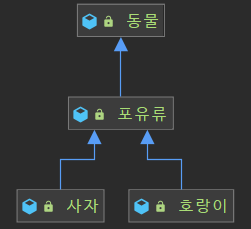

> REFERENCE:
>

[이펙티브 자바 Effective Java 3/E - YES24](http://www.yes24.com/Product/Goods/65551284)

[상속보다는 조합(Composition)을 사용하자.](https://tecoble.techcourse.co.kr/post/2020-05-18-inheritance-vs-composition/)

[https://github.com/woowacourse-study/2022-effective-java](https://github.com/woowacourse-study/2022-effective-java)

---

## 0️⃣. 우리가 상속을 하는 이유

다양한 이유로 우리는 상속을 이용하고 있습니다.

1. 코드를 재사용함으로써 중복을 줄일 수 있다.
2. 변화에 대한 유연성 및 확장성이 증가한다.
3. 개발 시간이 단축된다.

즉, 상속은 코드를 **재사용하는 강력한 수단**이다. 그렇지만 상속을 잘못 사용하면 **변화에 유연하지 않고, 오류를 내기 쉬운 소프트웨어**가 된다.

이 장에서의 상속은 **클래스가 다른 클래스를 확장하는 구현 상속**을 말하는 것이며, 클래스가 인터페이를 구현하거나 인터페이스가 다른 인터페이스를 확장하는 인터페이스 상속에 대한 이야기는 아니다.

## 1️⃣. 상속, 캡슐화를 깨트린다.

> *캡슐화: 만일의 상황(타인이 외부에서 조작)에 대비해 외부에서 특정 속성이나 메서드를 사용할 수 없도록 숨겨놓는 것.*
>

**상위 클래스의 구현이 아래 하위 클래스에게 노출되는 상속은 캡슐화를 깨트**린다. 캡슐화가 깨짐으로써 하위 클래스가 상위 클래스에 강하게 결합, 의존하게 되고 강한 결합, 의존은 변화에 유연하게 대처하기 어려워진다.

예제를 통해 확인헤보자.

**Lotto.class**

```java
public class Lotto {
    protected List<Integer> lottoNumbers;

    public Lotto(List<Integer> lottoNumbers) {
        this.lottoNumbers = new ArrayList<>(lottoNumbers);
    }

    public  boolean contains(Integer integer) {
        return this.lottoNumbers.contains(integer);
    }
		...
}
```

Lotto 클래스는 로또 번호를 List<Integer>로 가지고 있다.

**WinningLotto.class**

```java
public class WinningLotto extends Lotto {
    private final BonusBall bonusBall;

    public WinningLotto(List<Integer> lottoNumbers, BonusBall bonusBall) {
        super(lottoNumbers);
        this.bonusBall = bonusBall;
    }

    public long compare(Lotto lotto) {
        return lottoNumbers.stream()
            .filter(lotto::contains)
            .count();
    }
    ...
}
```

다음으로는 Lotto 클래스를 상속하는 Winning 클래스를 보자.

WinningLotto 클래스는 당첨 로또번호를 가지고 있는 클래스로 아직까지는 문제가 없어 보인다.

하지만, **Lotto클래스의 요구사항이 바뀌어서 인스턴스 변수인 List<Integer> lottoNumbers가 int[] lottoNumbers로 바뀌었다고 가정**해보자.

```java
public class Lotto {
    protected int[] lottoNumbers;

    public Lotto(int[] lottoNumbers) {
        this.lottoNumbers = lottoNumbers;
    }

    public boolean contains(Integer integer) {
        return Arrays.stream(lottoNumbers)
            .anyMatch(lottoNumber -> Objects.equals(lottoNumber, integer));
    }
    ...
}
```

부모와 강한 의존을 맺은 WinningLotto 클래스는 강한 영향을 받게 됩니다.

```java
public class WinningExtendLotto extends Lotto {
    private final BonusBall bonusBall;

		// 오류 발생
    public WinningExtendLotto(List<Integer> lottoNumbers, BonusBall bonusBall) {
        super(lottoNumbers);
        this.bonusBall = bonusBall;
    }

		// 오류 발생
    public long compare(Lotto lotto) {
        return lottoNumbers.stream()
                .filter(lotto::contains)
                .count();
    }
		...
}
```

즉, Lotto 클래스는 상속한 하위 클래스가 몇 개가 있든 전부 깨지게 되는 것입니다.

그리고 해결법은 모든 하위 클래스에서 일일이 수정을 해주는 방식뿐입니다. 또 상위 클래스 메소드 이름과 매개변수의 변화는 하위 클래스 전체의 변경을 야기하기도 합니다.

**이처럼 상속은 하위 클래스가 상위 클래스에 의존, 결합하기 때문에 변화에 유연하게 대처하기가 어려워집니다.**

## 2️⃣. 조합(Composition)을 사용하자.

> *조합(Composition): 기존 클래스가 새로운 클래스의 구성요소로 쓰인다.*
>
>
> *새로운 클래스를 만들고 private 필드로 기존 클래스의 인스턴스를 참조한다.*
>

앞서 살펴봤던 WinningLotto 클래스가 Lotto를 상속하는 것이 아닌 조합(Composition)을 사용하면 다음과 같이 됩니다.

```java
public class WinningCompositionLotto {

    private final BonusBall bonusBall;
    private final Lotto lotto;

    public WinningCompositionLotto(BonusBall bonusBall, Lotto lotto) {
        this.bonusBall = bonusBall;
        this.lotto = lotto;
    }
		...
}
```

이처럼 **WinningLotto 클래스에서 인스턴스 변수로 Lotto 클래스를 가지는 것이 조합(Composition)이라고 합니다**.

WinningLotto 클래스는 Lotto 클래스의 메소드를 호출하는 방식으로 동작하게 됩니다.

### 조합(Composition)을 사용하면?

1. 메소드를 호출하는 방식으로 동작하기 때문에 캡슐화를 깨트리지 않습니다.
2. Lotto 클래스 같은 기존 클래스의 변화에 영향이 적어지며, 안전하다

메소드 호출 방식이기 때문에 Lotto 클래스의 인스턴스 변수인
`List<Integer> lottoNumbers`가 `int[] lottoNumbers`로 바뀌어도 영향을 받지 않게 됩니다. 그저 메소드 호출을 통한 값을 사용하면 될 뿐이기 때문이다.

즉, 상속의 문제점들에서 벗어날 수 있다는 것입니다.

자기 자신에 대한 참조를 다른 객체에 넘겨, 나중에 필요할 때 역호출하도록 요청하는 역호출(callback) 프레임워크와 사용하기에는 적합하지 않단느 점만 주의하자.

## 3️⃣. 결론

캡슐화를 깨뜨리고, 상위 클래스에 의존하게 돼서 변화에 유연하지 못한 상속을 사용하기보다는 조합(Composition)을 사용하자.

하지만 조합(Composition)이 상속보다 무조건 좋다는 것은 아니다. 상속이 적절하게 사용되면 조합보다 강력하고, 개발하기도 편리하다.

단, 상속이 적절하게 사용되려면 최소 다음과 같은 조건을 만족해야 한다.

1. 확장을 고려하고 설계한 확실한 is - a 관계일 때
2. API에 아무런 결함이 없는 경우, 결함이 있다면 하위 클래스까지 전파돼도 괜찮은 경우



위와 같은 경우가 확실한 is - a 관계라고 생각한다.

```java
public class 포유류 extends 동물 {

    protected void 숨을쉬다() {
        ...
    }

    protected void 새끼를낳다() {
        ...
    }
}
```

포유류가 동물이라는 사실은 변할 가능성이 거의 없고,포유류가 숨을쉬고 새끼를 낳는다는 행동이 변할 가능성은 거의 없다.

이처럼 확실한 is - a 관계의 상위 클래스는 변할 일이 거의 없다.

사실 이런 조건을 만족하는 경우에도 상속은 조합과 달리 캡슐화를 깨뜨리기 때문에 100% 정답은 없다.

> **정말 중요한 사실은 상속은 코드 재사용의 개념으로만 사용하면 안된다는 것이다. 상속은 반드시 확장이라는 관점에서 사용해야 한다는 점을 명심하자.**
>