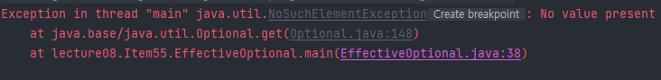

[이펙티브 자바 Effective Java 3/E - YES24](http://www.yes24.com/Product/Goods/65551284)

[https://github.com/woowacourse-study/2022-effective-java](https://github.com/woowacourse-study/2022-effective-java)

---

## 0️⃣. 서론

자바 8 전에는 메서드가 특정 조건에서 값을 반환할 수 없을 때 취할 수 있는 선택지가 두 가지 있었다.

- Exception Throw
    - 예외는 반드시 예외적인 상황에서만 사용해야 한다. (아이템 69)
    - 예외를 생성할 때 스택 추적 전체를
- Null Return
    - null을 리턴하는 경우에는 NPE(Null Pointer Exception)을 항상 조심해야한다.

자바 8이 등장하면서 Optional이라는 또 하나의 선택지가 추가되었다.

## 1️⃣. Optional이란?

- 자바 8이 되면서 `Optional<T>`을 사용할 수 있게 되었다.
- Optional이란, 값이 있을 수도 있고 없을 수도 있는 객체이다. 참조 타입의 객체를 한번 감싼 일종의 **래퍼 클래스** 이다.
- Optional은 원소를 최대 1개 가질 수 있는 **불변 Collection**이다.
- 자바 8 이전의 코드보다 null-safe한 로직을 처리 할 수 있게 해준다.
- **Optional을 반환하여 좀 더 로직을 유연하게 작성할 수 있게 해준다.**

보통 T를 반환해야 하지만 특정 조건에서는 아무것도 반환하지 않아야할 때 T 대신 Optional<T>를 반환하도록 선언한다.

옵셔널은 예외를 던지는 메소드보다 유연하고 null을 반환하는 메소드보다 오류 가능성이 적다.

```java
public static String prevFindSomething(List<String> list) {
        if (list.isEmpty()) {
            return null;
        }

        for (String s : list) {
            if (s.equals("something")) {
                return s;
            }
        }
        return null;
}
```

```java
public static Optional<String> advFindSomething(List<String> list) {
        if (list.isEmpty()){
            return Optional.empty();
        }

        for (String s : list) {
            if (s.equals("something")){
                return Optional.of(s);
            }
        }
        return Optional.empty();
}
```

## 2️⃣. Optional 안에 null을 담지 말자.

`Optional.of()` 메소드로 Optional 객체를 생성할 수 있다. 하지만 파라미터에 null을 담게 되면 언젠가는 NPE가 발생한다.

```java
public static void main(String[] args) {
        List<String> test = new LinkedList<>();

        Optional<String> s = advFindSomething(test);
        System.out.println(s.get());
}
```



만약 null 값도 허용하는 옵셔널을 만들어야 한다면 `Optional.ofNullable()` 메소드를 사용한다.

결론적으로 옵셔널을 반환하는 메소드에서 절대 null을 반환하지 말자

```java
return Optional.ofNullable(null);
```

**null을 포장하는 객체를 사용해서 다시 null을 담을 필요는 없다. Optional을 만든 취지를 무시하는 행동이다. 즉, ofNullable을 쓰지 않는 것이 올바른 경우가 많다.**

## 3️⃣. 그럼 언제 사용해야 하나요?

책에서는 `checkedExeption`과 취지가 비슷하다고 설명한다. **반환값이 없을 수도 있음을 API 사용자에게 명확히 알려준다는 점에서만 비슷**하다고 생각하면 좋을 것 같습니다.

결과가 없을 수 있으며, **클라이언트가 이 상황을 특별하게 처리해야 한다면 Optional을 반환한다.** 하지만 Optional도 엄연히 새로 할당하고 초기화해야 되는 객체이고 안에서 값을 꺼내려면 메서드를 호출하는 과정이 필요하다. 따라서 성능이 중요한 상황이라면 세심히 측정해보는 방법밖에 없다.

## 4️⃣. Optional을 처리하는 방법

1. 기본 값을 설정할 수 있다.

```java
String find1 = something.orElse("NONE");ㅇ
```

1. 원하는 예외를 던질 수 있다.

```java
String find2 = something.orElseThrow(IllegalArgumentException::new);ㅎ
```

1. 항상 값이 채어져 있다고 가정한다.

```java
String find3 = something.get();
```

1. orElse()에 설정하는 기본 값은 Optional의 값이 있어도 생성된다.

```java
public static void main(String[] args) {

        Optional<String> something = advFindSomething(List.of("something"));
        String find1 = something.orElse(nothing());
        String find2 = something.orElseGet(() -> nothing());
        // == String find3 = something.orElseGet(EffectiveOptional::nothing);
}

static String nothing() {
        System.out.println("나 생성되었어");
        return "No";
    }
}
```

`orElse`는 Optional의 값이 null이 아니더라도 생성되는 단점이 있습니다. 따라서, 비용이 큰 값을 설정하게 된다면 부담될 수 있기 때문에, `orElseGet`을 사용하여 초기 설정 비용을 낮춥니다.

## 5️⃣. 특별한 쓰임에 대비한 메소드

Optional 클래스에서 filter, map, flatmap의 메소드도 사용할 수 있다. Stream API가 제공하는 메소드와 동일한 기능을 수행한다. 이외에도 ifPresent, isPresent 등이 있다.

### A) isPresent

- 안전 벨브 역할의 메소드로, 옵셔널이 채워져 있으면 true를, 비어 있으면 false를 반환한다.
- 신중히 사용해야 하는데, 실제로 isPresent를 쓴 코드 중 상당수가 앞서 언급한 메소드들로 대체할 수 있으며, 더 짧고 명확하고 용법에 맞는 코드가 되기 때문이다.

```java
if (findSomething(List.of("something")).isPresent()) {
    System.out.println("찾았다.");
} else {
    System.out.println("못 찾았다.");
}
```

### B) ifPresent

- void타입으로 Optional 객체가 값을 가지고 있으면 특정 명령을 수행하고,  값이 없으면 넘어간다

```java
userRepository.findById(id).ifPresent(user -> {
		throw new IllegalArgumentException();
});
```

### C) map

```java
System.out.println("부모 PID:" +
	ph.parent().map(h-> String.valueOf(h.pid))).orElse("N/A");
```

스트림을 사용한다면 옵셔널들을 Stream<Optional>로 받아서, 그 중 채워진 옵셔널들에서 값을 뽑아 Stream에 건네 담아 처리하는 경우가 드물지 않다.

### D) filter

```java
streamOfOptionals
	.filter(Optional::isPresnet)
	.map(Optional::get)
```

Optional에 값이 있다면, 그 값을 꺼내서 스트림에 매핑한다.

### E) **flatMap**

```java
streamOfOptionals
	.flatMap(Optional::stream)
```

자바 9에서는 Optional에 stream() 메서드가 추가되었다. 이 메서드는 Optional을 Stream으로 변환해주는 어댑터다. 옵셔널에 값이 있으면 그 값을 원소로 담은 스트림으로, 값이 없다면 빈 스트림으로 변환한다.

## 6️⃣. 무조건 Optional로 감싼다고 이득은 아니다.

- **컬렉션, 스트림, 배열, 옵셔널 같은 컨테이너 타입은 옵셔널로 감싸면 안 된다.**
- 빈 Optional<List>를 반환하기보다는 빈 List를 반환하는게 좋다. (아이템 54)
    - 빈 컨테이너를 그대로 반환하면 클라이언트에 옵셔널 처리 코드를 넣지 않아도 된다.

위에 빈 List를 반환하는게 좋다는 예시를 한번 들어보자. 예를 들어 Map의 키로 **Optional을 사용하면 절대 안된다.** 일단 맵 안에 키가 없다는 사실을 나타내는 방법은 두 가지나 된다. 키가 없는 경우와 키가 있지만 키가 속이 빈 옵셔널일 경우이다. 쓸데없이 복잡하게만 만들어 혼란과 오류를 야기한다.

```java
List.of(Optional.of("A"), Optional.of("B"), Optional.empty());
Map.of(Optional.of("A"), 1, Optional.of("B"), 2);
```

- **박싱 타입을 Optional로 포장하지 말자**
    - **박싱**된(Integer, Double, Long 같은) 타입을 담는 옵셔널은 값을 두번이나 감싸기 때문에 기본타입보다 무거울 수 밖에 없다.
    - 그래서 자바 API 설계자는 int, long, double 전용 옵셔널 클래스를 준비해놨다.
    - `OptionalInt`, `OptionalLong`, `OptionalDouble`
    - 이 옵셔널들도 기본 옵셔널이 제공하는 메서드를 거의 다 제공한다.
    - 대체재가 있으니 박싱된 기본 타입을 담는 옵셔널을 반환하는 일은 없도록 하자

    ```java
    Optional.of(Integer.valueOf(1));
    ```

    - 옵셔널을 컬렉션의 키, 값, 원소, 배열의 원소로 사용하는 게 적절한 상황은 거의 없다.

## 7️⃣. 정리

- **결과가 없을 수 있으며, 클라이언트가 이 상황을 특별하게 처리해야 한다면 Optional을 반환**
- 하지만 옵셔널 반환에는 성능 저하가 뒤따르니, 성능에 민감한 메서드라면 null을 반환하거나 예외를 던지는 편이 나을 수 있다.
- 옵셔널을 반환값 이외의 용도로 쓰는 경우는 매우 드물다.